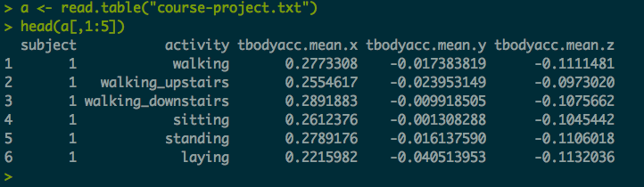

Course Project
===
##Getting and Cleaning Data
###Data Science, JHU coursera.org

As stated in the instructions for the course assignment:
>The purpose of this project is to demonstrate your ability to collect, work with, and clean a data set. The goal is to prepare tidy data that can be used for later analysis. 

The requirements of the project are:

* Prepare a tidy data set as described below, 
* Link to a Github repository with your script for performing the analysis, and 
* Create a code book, called CodeBook.md, that describes the variables, the data, and any transformations or work that you performed to clean up the data. 
* Create a README.md in the repo with describing the scripts and how they are connected. 

The data represents a set of observations regarding human activity recognition by use of smartphones.  For more information on the data please see the Code Book.

To accomplish the project requirements we were create one R script called run_analysis.R that:

* Merges the training and the test sets to create one data set.
* Extracts only the measurements on the mean and standard deviation for each measurement. 
* Uses descriptive variable names to name the columns in the data set.
* Appropriately labels the data set with descriptive activity names. 
* Creates a second, independent tidy data set with the average of each variable for each activity and each subject.

####Merges the training and test sets to create one data set.
The project provided the data set for download on the course project page for the course.  For more information see the Code Book.

Certain assumptions were made given the instructions provided for the project.
####The data set was already present in the users working directory.
The script does not attempt to download the file or unzip the file.
The script is written according to this assumption that the data set was already downloaded and unpacked into the working directory.

```
testX <- read.table("UCI HAR Dataset/test/X_test.txt") # -- measurement data (561 variables)
testY <- read.table("UCI HAR Dataset/test/Y_test.txt") # -- activity data (one variable)
testSubject <- read.table("UCI HAR Dataset/test/subject_test.txt") # -- subject data (one variable)
trainX <- read.table("UCI HAR Dataset/train/X_train.txt") # -- measurement data (561 variables)
trainY <- read.table("UCI HAR Dataset/train/Y_train.txt") # -- activity data (one variable)
trainSubject <- read.table("UCI HAR Dataset/train/subject_train.txt") # -- subject data (one variable)
features <- read.table("UCI HAR Dataset/features.txt") # -- column numbers and names (two variables)
features <- features[,2]
```

```
testDF <- cbind(testSubject,testY,testX)
trainDF <- cbind(trainSubject,trainY,trainX)
totalDF <- rbind(testDF,trainDF) # --- dataframe containing the total data set
```

#####Extracts only the measurements on the mean and standard deviation for each measurement.
From an examination of the data sets code book, certain variables were extracted that met the above referenced criteria.  As such, the variables extracted appeared to be calculations of the mean or standard deviation of such measurement.

```
columnSelection <- c(1:6,41:46,81:86,121:126,161:166,201:202,214:215,227:228,240:241,253:254,266:271,
                     345:350,424:429,503:504,516:517,529:530,542:543,555:561)
testX <- testX[,columnSelection] 
trainX <- trainX[,columnSelection]
```

#####Uses descriptive variable names to name the columns in the data set.
Variables in the original dataset were manipulated to appear more readable.  While there is apparent disagreement in standards for the variable names, e.g., some experts suggest all lower case, some suggest camel case, some suggest not to use '.', some experts suggest the use of the '.' -- the main goal was to produce easily readable variable names that do not interfer with the manipulation of the data.

To that goal, I choose to use camel case and '.' given the length of the variable names.
```
features <- read.table("UCI HAR Dataset/features.txt") # -- column numbers and names (two variables)
features <- features[,2] # -- subset to just the column names (one variable)
# Clean up the column names
features <- gsub("[[:punct:]]", "", features) # -- remove punct characters; e.g, (), _, -, etc ...
features <- gsub("fBodyBody","fBody",features) # -- replace "fBodyBody" with "fBody"
features <- gsub("X",".X",features) # -- add a . before 'X' for readability
features <- gsub("Y",".Y",features) # -- add a . before 'Y' for readability
features <- gsub("Z",".Z",features) # -- add a . before 'Z' for readability
features <- gsub("mean",".Mean",features) # -- add a . before and capitalize'mean' for readability
features <- gsub("std",".STD",features) # -- add a . before and capitalize'std' for readability
colnames(testX) <- features 
colnames(trainX) <- features
```

#####Appropriately labels the data set with descriptive activity names.
The original data set used numbers to identify the various activities the subjects performed.  The numbers were replaced with descriptive names.

```
aggregatedDF$activity[aggregatedDF$activity == 1] <- "walking"
aggregatedDF$activity[aggregatedDF$activity == 2] <- "walking_upstairs"
aggregatedDF$activity[aggregatedDF$activity == 3] <- "walking_downstairs"
aggregatedDF$activity[aggregatedDF$activity == 4] <- "sitting"
aggregatedDF$activity[aggregatedDF$activity == 5] <- "standing"
aggregatedDF$activity[aggregatedDF$activity == 6] <- "laying"
```

#####Creates a second, independent tidy data set with the average of each variable for each activity and each subject.
After cleaning the data, combining the data sets, enhancing the variable names and adding descriptive activity names a second data set was created by aggregating the data by subject and activity, and calculating the mean of each set of subject/activity pair sets.

```
aggregatedDF <- aggregate(totalDF, by=list(totalDF$activity,totalDF$subject), FUN=mean, na.rm=TRUE)
```

Lastly the tidy data set of aggregated data is written as a table to the working directory.
```
write.table(aggregatedDF, "course-project.txt", sep="\t")
```

####Snapshot of the data.
```
>> write.table(aggregatedDF, "course-project.txt", sep="\t")
>> a <- read.table("course-project.txt", sep="\t")
>> head(a[,c(1:5)])
```
